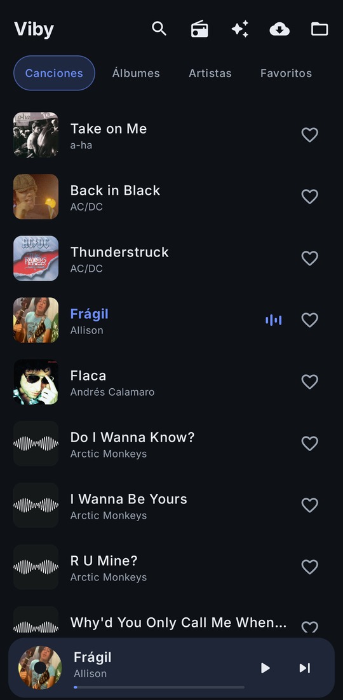
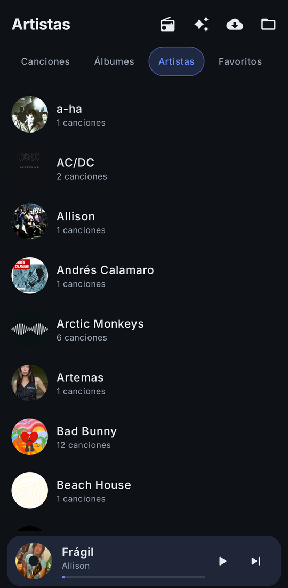
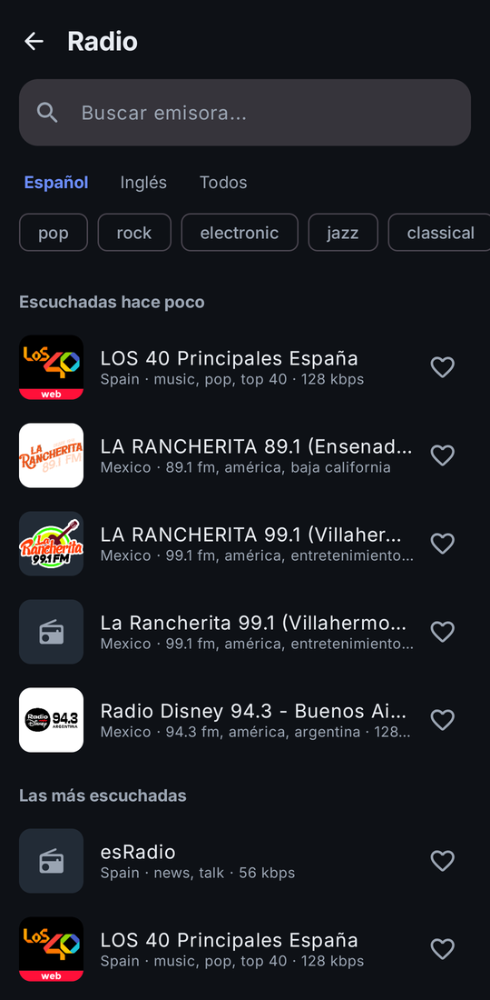

# Viby

Reproductor de música para Android, sin anuncios y con estética cuidada. Pensado para
escuchar tu biblioteca local (por ejemplo, la música descargada con
[y1-music-downloader](https://github.com/AmiiGood/y1-music-downloader)) y, además,
descubrir y descargar canciones nuevas desde la propia app.

> Proyecto personal. Uso sideload (no Play Store).

| Biblioteca | Artistas | Reproduciendo | Radio |
|:---:|:---:|:---:|:---:|
|  |  |  |  |

## Qué hace

- **Reproductor** con cola, aleatorio real, repetir, búsqueda y favoritos.
- **Pantalla "Reproduciendo"** a pantalla completa, arrastrable (sube/baja siguiendo el dedo).
  **El color sale de la carátula**: acento y fondo se extraen de la portada que suena y
  cambian con cada canción, con transición suave. Incluye "A continuación" y acceso al
  selector de salida de audio del sistema.
- **Navegación por pestañas** en la cabecera: Canciones · Álbumes · Artistas · Favoritos.
  La canción en curso se marca con barras de nivel animadas, que se congelan al pausar.
- **Artistas con foto**, descargada una sola vez y guardada como `artist.jpg` en la
  carpeta del artista: sobrevive a reinstalar la app y viaja con la música. Los nombres
  se unifican (mayúsculas, acentos, artículo inicial) y las colaboraciones cuentan para
  los dos, sin partir a grupos como AC/DC o Earth, Wind & Fire. Para los que son el
  mismo y no hay forma de deducirlo del nombre (Panda y PXNDX), se mantiene pulsado un
  artista y se elige con cuál unirlo.
- **Notificación y pantalla bloqueada** con carátula (Media3 / ExoPlayer).
- **Ecualizador** integrado.
- **Reanuda** donde te quedaste y recuerda aleatorio/repetir.
- **Mini reproductor** con la carátula como disco que gira mientras suena y se detiene al pausar.
- **Descargas** integradas (NewPipeExtractor): busca, escucha un preview —que suena en
  el reproductor de verdad, así que sigue al salir de la pantalla y sale en la
  notificación—, descarga a
  `Artista/Álbum/Título.m4a` con tags ID3 + carátula (enriquecido con MusicBrainz),
  en segundo plano con notificación de progreso y sin duplicados.
- **Descubrir**: recomendaciones de música nueva basadas en tu biblioteca.
- **Radio**: miles de emisoras de internet vía [Radio Browser](https://www.radio-browser.info/)
  (catálogo abierto, sin cuenta ni API key). Busca por nombre, filtra por género,
  guarda favoritas y reconecta sola cuando el stream se corta.
- **Widget de inicio**: carátula, título, artista y controles anterior/pausa/siguiente,
  con el color tomado de la portada que suena.

## Stack

Kotlin · Jetpack Compose (Material 3) · Media3/ExoPlayer · Coil · Glance (widget) ·
Palette (color desde la carátula) · NewPipeExtractor · jaudiotagger · MusicBrainz ·
Radio Browser · iTunes Search (carátulas de radio y fotos de artista) · minSdk 26 · targetSdk 36.

## Compilar

1. Abre el proyecto en Android Studio y deja que sincronice Gradle.
2. Conecta un dispositivo (o usa un emulador) y dale a **Run**.
3. En la app, elige la carpeta donde está tu música (selector del sistema).

### Firmar la release

La release se firma con una clave propia, no con la de depuración. Esto importa:
Android Studio genera la clave de depuración sola y es **distinta en cada
máquina**, así que una app firmada con ella no se puede actualizar desde otro
equipo — hay que desinstalar, perdiendo favoritos y la carpeta elegida.

La clave y su contraseña van en `local.properties`, que está en `.gitignore`:

```properties
viby.keystore=/ruta/a/viby-release.jks
viby.keystore.password=...
viby.key.alias=viby
viby.key.password=...
```

Sin esas claves el proyecto compila igual, pero la release cae a la clave de
depuración y no podrá actualizar una instalación existente.

> **Guarda copia del `.jks` y de la contraseña.** Es lo único que permite
> actualizar la app; si se pierden, la única salida es desinstalar y empezar de
> cero.

## Licencia

Uso personal.
